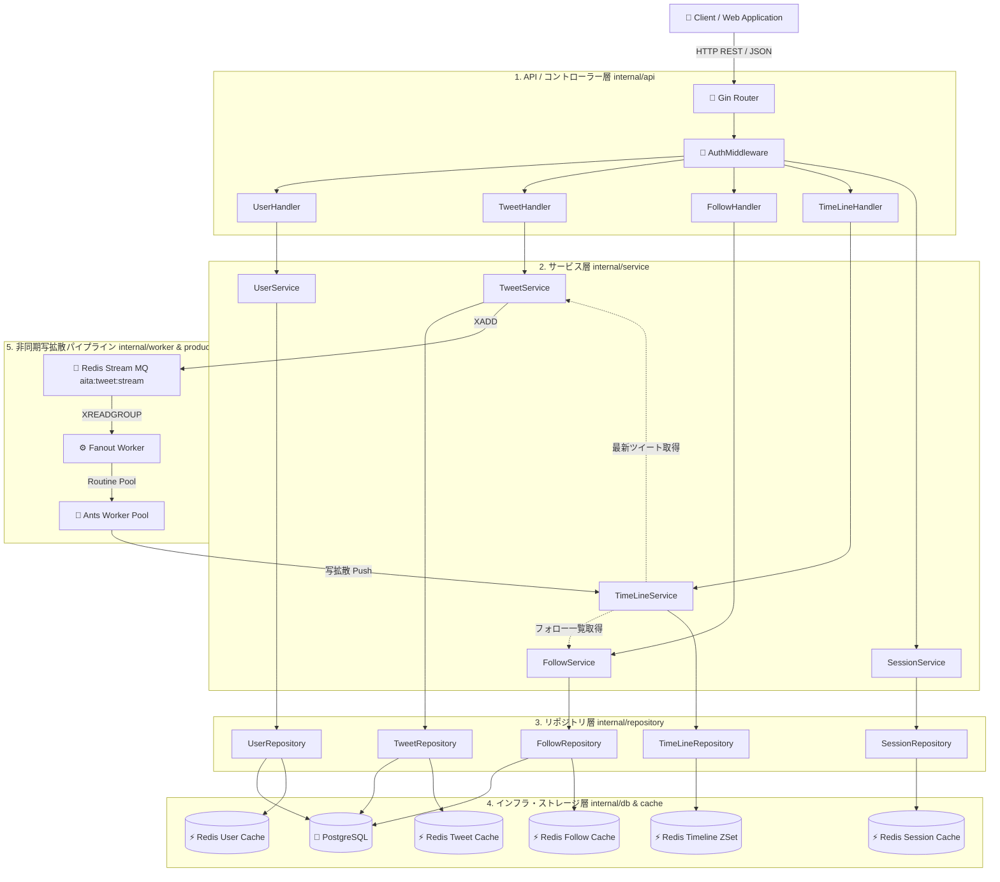
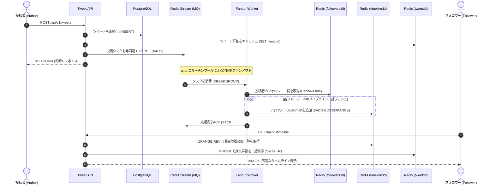
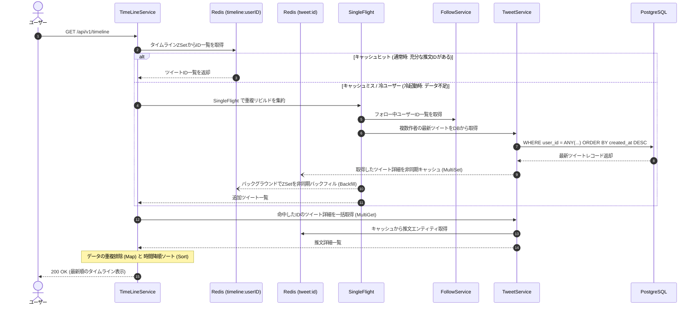

# AITA - 高性能ソーシャルメディア・バックエンドプラットフォーム
AITAは、Go (Golang) で構築された、高並列・スケーラブルなSNSバックエンドプラットフォームです。大規模なユーザー利用シーンを想定し、高速なセッション認証、リアルタイムな情報配信（Push-Pull混合タイムライン）、Redis Streamsによる非同期写拡散パイプラインの実装に焦点を当てています。
---
## 🚀 開発状況 (Development Status)
- **フェーズ 1 (完了)**: ユーザー認証システム、データベース基盤（PostgreSQL）、ユニットテストおよび結合テストの構築。
- **フェーズ 2 (完了)**: Redis Streams による非同期タスク処理、ツイート投稿、タイムライン（Feed）配信・キャッシュ最適化・自癒リビルドの実装。
- **フェーズ 3 (進行中/予定)**: Elasticsearch による投稿内容の全文検索エンジンの統合、画像アップロード機能。
---
## 🛠 技術スタック (Tech Stack)
- **言語**: Go 1.21+
- **Webフレームワーク**: Gin Gonic
- **データベース**: PostgreSQL (sqlx による効率的なマッピング)
- **キャッシュ / MQ**: Redis (Session管理, Tweet/Timeline Cache, Redis Streams)
- **並行処理ライブラリ**: `panjf2000/ants/v2` (Goroutine Pool), `golang.org/x/sync/singleflight`
- **インフラ**: Docker & Docker Compose
- **マイグレーション**: `golang-migrate`
---
## 🏛 システムアーキテクチャ (Architecture)

---
## ⚡ コアフロー (Core Workflows)
### 1. 投稿とタイムライン配信の流れ (Write Fan-out Pipeline)

---
### 2. タイムラインのキャッシュミスと自癒リビルド (Pull Fallback)

---
## ✨ 主な機能と技術的特徴 (Key Features)
### 実装済み (Implemented)
* **クリーンアーキテクチャ (Clean Architecture)**:
  `api/`, `service/`, `repository/`, `db/cache/` を明確に分離したレイヤード設計。疎結合と高いテスト容易性を確保。
* **高並列写拡散 (Write Fan-out Architecture)**:
  Redis Streams (MQ) と Consumer Group を採用。投稿時のAPI遅延を排除し、Ants Goroutine Pool による並列処理でフォロワーの Redis ZSet へ高速配信。
* **推拉結合（Push-Pull Hybrid）タイムライン**:
  通常時は Redis ZSet から $O(\log N)$ で読み込むプッシュ型。冷ユーザーやキャッシュ蒸発時は SingleFlight を用いて安全に DB から動的リビルドし、キャッシュを自癒（Backfill）するプル型フォールバックを完備。
* **キャッシュスタンピード / 雪崩対策**:
  * **SingleFlight**: 同一キーへの同時アクセスを1回に集約し、DBへの負荷集中を防止。
  * **Jitter Expiration**: キャッシュ有効期限にランダムな揺らぎ（Jitter）を持たせ、一斉失効を防止。
* **ID・コンテンツ分離設計 (Two-Step Query)**:
  Timeline ZSet には ID と時間スコアのみを保持。本体データは Redis の `tweet:<id>` から `MultiGet` でキャッシュヒット率を最大化。
* **セッション認証システム**:
  Bcrypt ハッシュ化パスワード + 独自トークン管理（有効期限の自動非同期ローテーション機能付き）。
---
## 📁 プロジェクト構成 (Directory Structure)
```text
.
├── cmd/
│   └── api/                # メインプログラム (main.go - 依存注入と起動)
├── internal/
│   ├── api/                # HTTPハンドラー, ルーティング, 認可ミドルウェア
│   ├── cache/              # Redisアクセス層（Pipeline, Jitter, ZSet, Hash）
│   ├── configuration/      # 設定情報の読み込み (.env, Config)
│   ├── contextkeys/        # コンテキストキー定義
│   ├── db/                 # PostgreSQL永続化層（sqlx）
│   ├── dto/                # Data Transfer Object（リクエスト/レスポンス変換）
│   ├── errcode/            # 業務エラーコードとHTTPステータスのマッピング
│   ├── models/             # DBエンティティ定義
│   ├── pkg/
│   │    ├── app            # 統一APIレスポンスエンベロープ（Success/Fail）
│   │    ├── crypto         # 暗号化, Bcrypt, Token生成
│   │    ├── messagequeue   # Redis Streamのメッセージキュー抽象化
│   │    ├── singleflight   # データベース重複クエリ集約
│   │    └── utils          # 共通ユーティリティ
│   ├── producer            # 非同期タスクのMQエンキュー層
│   ├── repository          # Cache-Asideパターンの統括とデータ整合性管理
│   ├── service             # 業務ロジックの核（Tweet, Follow, User, TimeLine）
│   ├── testconfig          # テスト環境の独立制御（DB/Redisマイグレーション）
│   └── worker              # MQコンシューマー常駐監視・タスク分散実行
├── scripts/
│   └── init-db/            # DB初期化スクリプト
├── migrations/             # SQLマイグレーションファイル（golang-migrate）
└── tests/                  # 結合テスト（ユーザーフローE2E）
```
---
## 🗺 今後のロードマップ (Roadmap)
- [ ] **Elasticsearch 連携**: 投稿内容の日本語/多言語全文検索エンジンの統合。
- [ ] **メディアアップロード**: クラウドオブジェクトストレージ（GCS / S3 / MinIO）による画像アップロード対応。
- [ ] **推拉最適化（大V対策）**: 超人気アカウント向けのセレブリティ・プル配信モードの実装。
- [ ] **k6 負荷テスト**: 高同時実行環境における RPS / レイテンシベンチマークの計測。